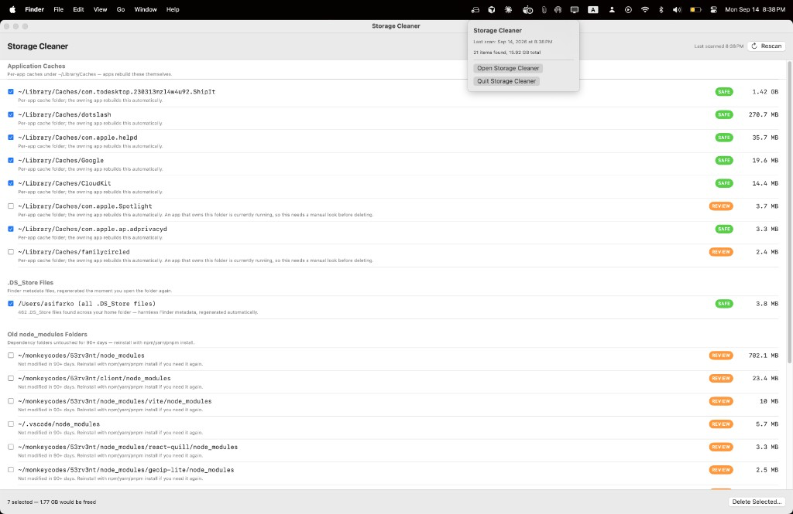

# Storage Cleaner

[](LICENSE)
[](Package.swift)
[](Package.swift)

A native macOS menu-bar app that scans your disk for caches, logs, and other regenerable clutter, groups it by safety tier, and lets you delete selected items with one click — with hard safeguards so it cannot touch things that would break an app or lose your data.

No third-party dependencies. Plain Swift Package, SwiftUI + AppKit.

<p align="center">
  
</p>

## Features

- Menu-bar app with a full review window
- Groups findings by category (Xcode DerivedData, package manager caches, app caches, logs, Trash, Docker, and more)
- Three safety tiers: **SAFE**, **REVIEW**, and **PROTECTED**
- SAFE items can be pre-selected after a scan; REVIEW items always require a deliberate opt-in
- Running-app safeguard: live caches owned by a currently running app are downgraded to REVIEW
- Protected-path check runs twice — once while building the list, and again immediately before any delete
- Permanent deletion only after explicit confirmation
- Audit log of every deletion at `~/Library/Application Support/StorageCleaner/deletion_log.jsonl`

## Requirements

- macOS 13 (Ventura) or later
- [Xcode Command Line Tools](https://developer.apple.com/xcode/resources/) (`xcode-select --install`)

## Getting started

**From Finder:** double-click `run.command`. The first launch compiles the app (typically 15–30 seconds); later launches start much faster.

If Gatekeeper blocks the script, right-click `run.command` → **Open**, then confirm.

**From Terminal** (after cloning this repository):

```bash
cd StorageCleaner
swift run -c release
```

Once running, look for the external-drive icon in the menu bar (near the clock). Click it → **Open Storage Cleaner**, then **Scan Now**. Review the results, check what you want gone, and click **Delete Selected…**.

To quit, click the menu bar icon → **Quit Storage Cleaner**.

## How the safety model works

Every item the scanner finds gets one of three tiers:

- **SAFE (green)** — well-known, regenerable caches: Xcode DerivedData, package manager caches (npm / pnpm / pip / cargo / Homebrew), per-app caches under `~/Library/Caches`, log files, `.DS_Store` files, Trash. These are pre-checked after a scan, but nothing is deleted until you click **Delete Selected…** and confirm.
- **REVIEW (yellow)** — regenerable but slower or costlier to rebuild, or a decision that needs a human: old `node_modules` folders, Rust toolchains, Docker’s VM disk (removing it wipes all local images and containers). Never pre-checked — you opt in per item.
- **PROTECTED (red)** — never shown as selectable. This includes:
  - `~/Library/Keychains`, `~/.ssh`, `~/.gnupg`, `~/.aws`, `~/.netrc`, and anything that looks like a private key file
  - `~/Documents`, `~/Desktop`, `~/Pictures`, `~/Movies`, `~/Music`, `~/Library/Mail`, `~/Library/Messages`, `~/Library/Photos`
  - `~/Library/Preferences` (app settings), `~/Library/CloudStorage` (iCloud Drive / Dropbox / etc.), iOS device backups
  - anything inside a `.git` folder or an `.app` bundle
  - anything outside your home folder (no sudo, ever)

**Running-app safeguard:** before showing a cache folder as SAFE, the scanner checks whether a currently running app appears to own it (matched by bundle ID and app name against `~/Library/Caches/<id>` and `~/Library/Application Support/<name>`). Matches are automatically downgraded to REVIEW.

**Belt and suspenders:** the protected-path check runs twice — once when building the list (so protected items never appear) and again inside the delete routine, immediately before touching disk. A bug anywhere else in the app can only ever cause it to refuse a deletion, never the reverse.

**Deletion is permanent.** There is no Trash step. Every deletion is appended to an audit log at `~/Library/Application Support/StorageCleaner/deletion_log.jsonl` with the path, size, and timestamp.

## Extending it

The rules engine lives in two files:

- [`Sources/StorageCleaner/ScanRules.swift`](Sources/StorageCleaner/ScanRules.swift) — the protected list
- [`Sources/StorageCleaner/Scanner.swift`](Sources/StorageCleaner/Scanner.swift) — what gets scanned and how it is categorized

Add a new `consider(...)` call in `Scanner` to teach it about another cache location, or add a path to `protectedSuffixes` in `ScanRules` to put something permanently off-limits.

## License

This project is licensed under the [MIT License](LICENSE).
